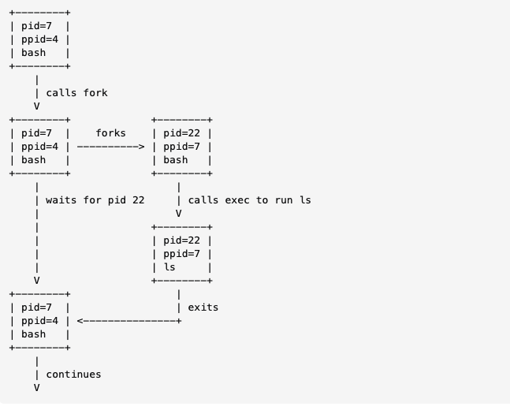

# B-Shell
Simplistic Unix shell in C

## Table of Contents

- [B-Shell](#b-shell)
- [Function](#function)
- [Why C++?](#why-c++?)
- [Approach](#approach)
  - [Basic Loop](#basic-loop)
    - [1. Reading a Line](#1.-reading-a-line)
    - [2. Parsing the Line](#2.-parsing-the-line)
    - [3. Executing](#3.-executing)
- [How Shells Start Processes](#how-shells-start-processes)
- [Shell Builtins](#shell-builtins)
- [Piping & Redirection](#piping-&-redirection)
- [Design](#design)
  - [`Shell`](#`shell`)
  - [`CommandParser`](#`commandparser`)
  - [Built-in `Command`s](#built-in-`command`s)
  - [External `Command`s](#external-`command`s)
  - [`IOHandler`](#`iohandler`)
  - [`Environment`](#`environment`)
  - [`History`](#`history`)

# Function

- **initialise:** read & execute config files
- **interpret:** read from stdin (terminal or file) and execute ⇒ *The focus of project*
- **terminate:** executes shutdown commands, frees up memory, terminates

# Why C++?

- **Memory Management**: Handle command input/output buffers, environment variables, and child processes.
- **Generic Programming**: Make it extendable with templates for handling different kinds of input/output streams.
- **OOP**: Design a modular shell where components (commands, parsers, interpreters) are all objects with clear interfaces.
- **Functional Programming**: Implement pipes and redirection using higher-order functions that can manipulate streams of input/output.

# Approach

## Basic Loop

### 1. Reading a Line

- Read from stdin
- Use a do-while loop inside `loop()` function
- extract `line` and `args` ⇒ need to split line into args, then execute
    - `read_line()` and `split_line()`

### 2. Parsing the Line

- Separate command string into a program and arguments
- Assume whitespace separates arguments
- `echo "this message"` would have two arguments `"this` and `message"`

### 3. Executing

- Run parsed command
- `execute(args)` first checks for each builtin, and if no match then calls `launch()`

# How Shells Start Processes

- main function of shells
- Two ways to create new child processes: `fork()` and `exec()`
    - When computer boots, kernel is loaded and initialised, and **one process** called `init` begins, runs for entire length of time computer is on, manages rest of processes
    - `fork()` is a **system call** where OS duplicates a process and both start running. Original is **parent** and new one is **child**. `fork()` returns 0 to child process, and the PID of the child to the parent process. **Basically a clone** (just with different PID)
    - `exec()` is a **system call** which replaces the current running program with an entirely new one. OS stops current process, loads up new one, and starts it. Spawned process **never returns** from `exec()`

<aside>
💡

- Most programs are run by running `fork()` and then `exec()` **in sequence**
- Current process `fork()`s into two separate ones, then the child uses `exec()` with a new program
</aside>

- Whenever a shell **executes** a program like `find` the shell does a `fork()` , the **child** loads the `find` program into memory using `exec()` and sets up the command line arguments, standard I/O, etc.

<aside>
💡

***Q: Does the shell always `wait()` on the forked child process?***

- Yes for **regular** (foreground) commands. It calls `waitpid()` to pause execution until the child process finishes, then **regains control** after command completes and **resumes** interaction with user
- but **background process** (with an ampersand `&`) means the shell doesn’t wait, but immediately returns control to the user. The shell **doesn’t block** but they still monitor the child in the background
    - E.g. `sleep 10 &` will make the forked process sleep for 10 seconds, but the parent process will immediately return control to the user
    - After running it, the shell displays the job number and PID of background process like `[1] 12345` (job 1, PID 12345)
</aside>

- We will use `execvp()`, a variant of `exec`
    - We give a vector of arguments `v` and the path `p` to be searched

# Shell Builtins

- some commands **have** to be built into the shell, when we want to **change the state of the shell itself**
    - `chdir()` `exit()` `help` are good examples
- Configuration scripts like `~/.bashrc` use commands to change the operation of the shell ⇒ could only change the shell’s operation if implemented **within the shell process itself**

# Piping & Redirection

TODO

# Design

- Aim is to produce a **modular, object-oriented design** and use **templates** to enhance flexibility

## `Shell`

- has the main function `run()` which gets called in `main.cpp`
- Displays prompt → reads user input → parses input into commands → executes commands

## `CommandParser`

- converts raw user input into **structured command objects**
- tokenise input string → identify commands → handle special characters (pipes/redirection)
- possibly add **globbing** (later)

## Built-in `Command`s

- will inherit from `Command` interface
- implements specific functionalities for each built-in

## External `Command`s

- again inherit from `Command` interface
- Uses system calls to create child process and execute external commands

## `IOHandler`

- Manage input and output redirection like `>`, `<`, `|`. Handle piping between commands

## `Environment`

- to be added later, retrieves and sets environment variables

## `History`

- stores executed commands, keeps track of history for navigation and retrieval
